## <span style="color: yellow;"> Transform Existing Infrastructure into Reusable Code with Terraformer </span>
In the fast-paced world of DevOps, automation is key to optimizing the software development lifecycle. One of the fundamental principles of DevOps is Infrastructure as Code (IaC), which ensures that infrastructure management is consistent, repeatable, and version-controlled. But what if your infrastructure was created manually? How can you bring pre-existing infrastructure under the IaC umbrella? This is where tools like Terraformer come into play.

## <span style="color: yellow;">Why Use Terraformer?
__Transitioning to Infrastructure as Code (IaC)__ is a smart move for any organization looking to enhance its cloud operations. However, if you’ve already got infrastructure set up, manually writing Terraform code for everything can be tedious and error-prone. Here’s where Terraformer comes in:

__Automated Code Generation__: Terraformer scans your existing cloud infrastructure and generates the equivalent Terraform code automatically. This eliminates the need to manually write code for resources that are already deployed.

__Consistency and Accuracy__: By generating Terraform code directly from the existing infrastructure, you ensure that the generated code accurately reflects the current state of your environment. This consistency reduces the risk of configuration drift, where the actual infrastructure deviates from what’s defined in code.

__Simplifies Onboarding__: If your organization is new to Terraform, Terraformer can help fast-track the onboarding process. Instead of starting from scratch, your team can work with the generated Terraform code, making it easier to understand and manage existing resources.

__Supports Multiple Cloud Providers__: Terraformer supports a wide range of cloud providers, including AWS, GCP, Azure, Kubernetes, and more. This flexibility allows you to generate Terraform code for different parts of your infrastructure, even if they are spread across multiple providers.

## <span style="color: yellow;">Key Benefits of Using Terraformer
__Time-Saving__: Automatically generating Terraform code saves hours, if not days, of manual coding.

__Improved Collaboration__: Teams can collaborate better by working on a standardized set of Terraform files, ensuring everyone is on the same page.

__Reduced Human Error__: By automating the code generation process, you reduce the risk of human error that can occur during manual coding.

__Seamless Integration with Terraform__: Since Terraformer generates Terraform code, it fits seamlessly into your existing Terraform workflows.

## <span style="color: yellow;">Understanding the Challenge </span>
Imagine you have a sprawling infrastructure set up manually over time. As your organization adopts DevOps practices, you realize the need to manage this infrastructure through code. However, manually writing the code for each resource, especially in large setups, is not only time-consuming but also error-prone. Tools like Terraform have an import feature, but it comes with limitations, particularly in generating code and managing dependencies among resources.

## <span style="color: yellow;">Terraform Import: A Good Start but Limited</span>
Terraform's import command allows you to import existing resources into your Terraform state file. While this is useful for tracking the state of your infrastructure, it doesn’t generate the Terraform code needed to manage those resources. Moreover, it may not support all resource types or attributes, and managing the state file can become cumbersome as your infrastructure grows.

For example, if you have an existing Virtual Private Cloud (VPC) setup, you can use Terraform's import command to include it in your state file. However, you'll still need to manually write the Terraform code for that VPC, which can be complex if your infrastructure includes multiple interconnected resources like subnets, routing tables, and security groups.

## <span style="color: yellow;">Introducing Terraformer: A Step Ahead
Terraformer is an open-source CLI tool that simplifies the process of converting existing infrastructure into Terraform code. Developed by an Israel-based tech firm and later acquired by Google, Terraformer addresses the limitations of Terraform's import feature by automatically generating both the Terraform state file and the corresponding code.

### <span style="color: cyan;">Key Features of Terraformer:
- Supports Multiple Cloud Providers: Terraformer currently supports ```17``` cloud providers, including AWS, Azure, and Google Cloud, as well as platforms like Kubernetes and Okta.
- Selective Resource Import: You can choose to import all resources in a region or select specific resources, making it flexible for different scenarios.
- Read-Only Permissions: Terraformer works with read-only permissions, ensuring that you don’t need to grant excessive privileges to generate the necessary code.

### <span style="color: red;">Pre-requisites

- install Terraformer
- AWS CLI
- Configure AWS CLI

### Practical Example: Using Terraformer
[Terraformer Release](https://github.com/GoogleCloudPlatform/terraformer/releases)

Let's dive into a practical example to see how Terraformer works.
### Task 01. <span style="color: orange;">__Installing Terraformer__</span>: 
First, install Terraformer based on your operating system (Linux, macOS, or Windows). Follow the instructions provided in the [official Terraformer GitHub repository](https://github.com/GoogleCloudPlatform/terraformer).

- System Update

Before installing Terraformer, ensure your system is up to date by running the following commands:
```bash
sudo apt update
sudo apt-get install curl wget -y
```
- Install Git

Terraformer is available as a Go package, and you’ll need Git to clone the repository. Install Git using the following command:
```bash
sudo apt install git -y
```
- Install Go

Terraformer is written in Go, so you need to install the Go programming language.
- Download the latest Go version:
```bash
wget https://go.dev/dl/go1.22.0.linux-amd64.tar.gz
```
- Extract the downloaded tarball to /usr/local:
```bash
sudo tar -C /usr/local -xvzf go1.22.0.linux-amd64.tar.gz
```
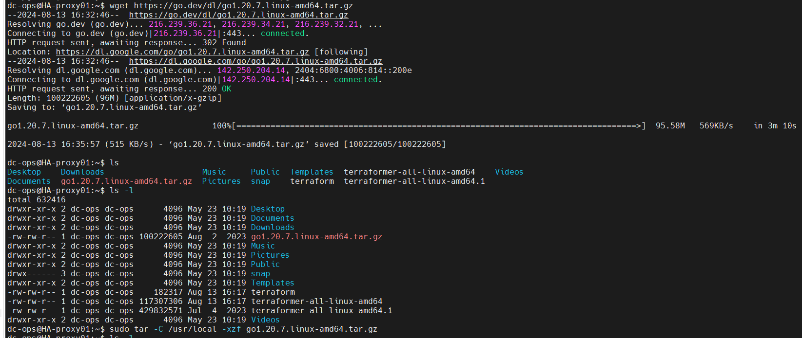

- Add Go to your system's PATH by editing your shell profile (.bashrc or .zshrc):
```bash
echo "export PATH=$PATH:/usr/local/go/bin" >> ~/.bashrc
source ~/.bashrc
```
- Verify the installation:
```bash
go version
```
Outcome- 
```bash
$ go version
go version go1.22.0 linux/amd64
```
- Install Terraformer
```bash
export PROVIDER=aws
curl -LO "https://github.com/GoogleCloudPlatform/terraformer/releases/download/$(curl -s https://api.github.com/repos/GoogleCloudPlatform/terraformer/releases/latest | grep tag_name | cut -d '"' -f 4)/terraformer-${PROVIDER}-linux-amd64"
chmod +x terraformer-${PROVIDER}-linux-amd64
sudo mv terraformer-${PROVIDER}-linux-amd64 /usr/local/bin/terraformer
```
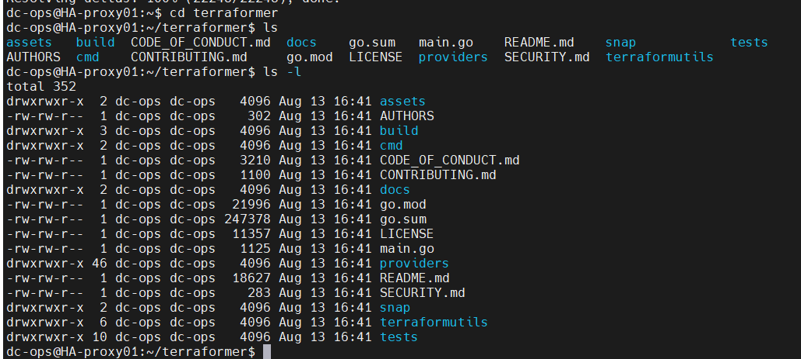

- Clone the Terraformer repository:
```bash
git clone https://github.com/GoogleCloudPlatform/terraformer
```
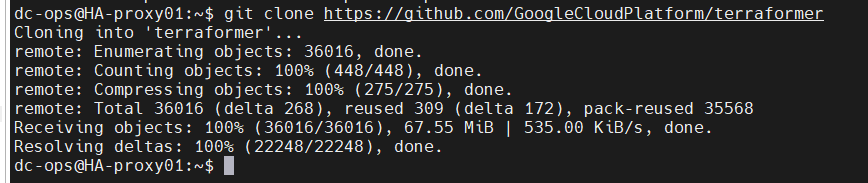

- Navigate to the Terraformer directory:
```bash
cd terraformer
```
- Build the Terraformer binary:
```bash
# go mod init
go mod tidy
go mod download
go run -v build/main.go aws
# go build -o terraformer ./cmd/terraformer/providers/aws  # Now, build the Terraformer binary, but only include the AWS provider:
# go build -o terraformer # for all providers 
```
<!-- * Move the binary to a directory in your PATH, so it can be accessed globally:
    ```bash
    cd ..
    sudo mv terraformer /usr/local/bin/
    ``` -->
- Verify the installation by checking the version:
```bash
terraformer --version
```
outcome:
```html
$ terraformer --version
version v0.8.24
```
- <span style="color: yellow;">Set Up Terraformer</span>

Terraformer requires Terraform to be installed and configured on your system. Ensure Terraform is installed:
- Install Terraform:
```bash
cd ..

sudo apt-get update && sudo apt-get install -y gnupg software-properties-common curl
curl -fsSL https://apt.releases.hashicorp.com/gpg | sudo gpg --dearmor -o /usr/share/keyrings/hashicorp-archive-keyring.gpg
echo "deb [signed-by=/usr/share/keyrings/hashicorp-archive-keyring.gpg] https://apt.releases.hashicorp.com $(lsb_release -cs) main" | sudo tee /etc/apt/sources.list.d/hashicorp.list
sudo apt update
sudo apt install terraform
```
- Verify the Terraform installation:
```bash
terraform --version
```
- Clean Up, Optionally, you can remove the Go tarball and the Terraformer source directory:
```bash
rm go1.22.0.linux-amd64.tar.gz
rm -rf terraformer
```
__Note__ : We have now successfully installed Terraformer on Ubuntu 24.04 LTS. You can use Terraformer to import infrastructure resources into Terraform configuration files from various cloud providers.

### Task 02. <span style="color: orange;">Configuring Cloud Credentials</span>: 
Ensure your AWS CLI is configured with the necessary credentials.

- Install Required Packages
Install unzip and curl, which are required to download and install the AWS CLI.
```bash
sudo apt install unzip curl -y
```
- Download the AWS CLI Installer
Download the AWS CLI version 2 installation file using curl.
```bash

curl "https://awscli.amazonaws.com/awscli-exe-linux-x86_64.zip" -o "awscliv2.zip"
```
- Unzip the Installation File
Unzip the AWS CLI installation file.
```bash
unzip awscliv2.zip
```
- Run the Installer
Run the installer script to install AWS CLI.
```bash
sudo ./aws/install
```
- Verify the Installation
After the installation is complete, verify that the AWS CLI was installed correctly by checking its version.
```bash
aws --version

# You should see output similar to:
aws-cli/2.17.28 Python/3.11.9 Linux/6.8.0-1009-aws exe/x86_64.ubuntu.24
```
- Clean Up:
Optionally, you can remove the downloaded files to clean up your directory.
```bash
rm awscliv2.zip
rm -rf aws
```
- Configure AWS CLI
Finally, configure your AWS CLI with your credentials (Access Key ID and Secret Access Key).
```bash
aws configure
```
You'll be prompted to enter your AWS Access Key ID, Secret Access Key, default region name, and default output format (e.g., json). After this, your AWS CLI will be set up and ready to use.

## <span style="color: yellow;">Test Terraformer

- Create a working folder and initialize the Terraform provider plugin. This folder will be where you run Terraformer commands.

Execute the command ```terraform init``` with a ```versions.tf``` file to install the necessary plugins for your platform. For instance, if you require plugins for the ```AWS``` provider, your ```versions.tf``` file should include the following configuration:

- Create a folder and inside the folder create a ```version.tf``` file.
```bash
mkdir aws_testing && cd aws_testing
```
conent of ```version.tf``` file
```sh
vi version.tf
```
Paste the following text into version.tf file.
```bash
terraform {
  required_providers {
    aws = {
      source  = "registry.terraform.io/hashicorp/aws"
      version = "~> 5.0"  # Replace with the latest version or version constraint as needed
    }
  }
  required_version = ">= 1.0"  # Update to the latest Terraform version
}
```
will initiate a terraform init command
```bash
terraform init
or 
terraform init -upgrade
```
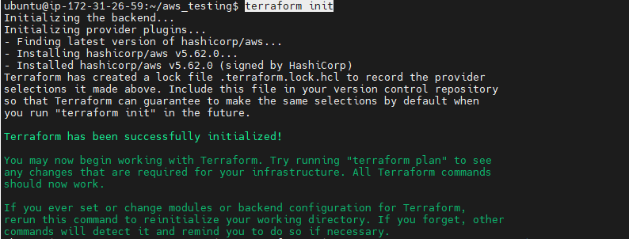

## <span style="color: yellow;">Testing:</span>

### 01. Terraformer import for the <span style="color: yellow;">```single resource```</span>

- Running Terraformer: Use the following command to import a VPC from the us-east-1 region:
```bash
cd aws_testing
terraformer import aws --resources=vpc --regions=us-east-1
```
This command imports all VPC resources in the specified region and generates the corresponding Terraform files.

__Exploring the Output__: After running the command, Terraformer creates a directory structure under generated/aws/vpc/ that includes the Terraform configuration files (main.tf) and the state file.

For example, the generated main.tf file will contain all the necessary configurations for your VPC, including subnets, routing tables, and security groups, along with their interdependencies.
```hcl
resource "aws_vpc" "my_vpc" {
  cidr_block = "10.0.0.0/16"
  tags = {
    Name = "my-vpc"
  }
}
```

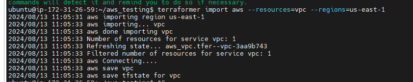

```generated```folder would be created automatically and inside this folder aws/vpc is created.
```bash
/home/ubuntu/aws_testing/generated/aws/vpc
```
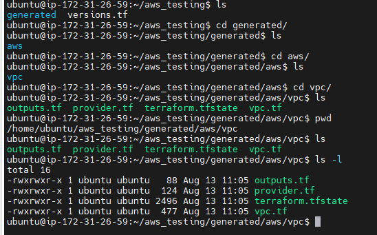


### <span style="color: yellow;">More Example</span>  
- s3  --> terraformer import aws --resources=s3 --regions=us-east-1
- ec2  --> terraformer import aws --resources=ec2_instance --regions=us-east-1
- 
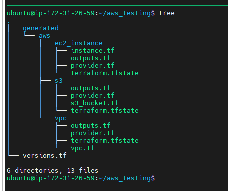


### 2.  Terraformer import for <span style="color: yellow;">```Multiple Resources```</span>
```bash
$ terraformer import aws --resources=rds,lambda --regions=us-east-1
2024/08/13 11:56:45 aws importing region us-east-1
2024/08/13 11:56:47 aws importing... rds
2024/08/13 11:56:47 aws done importing rds
2024/08/13 11:56:47 aws importing... lambda
2024/08/13 11:56:47 aws done importing lambda
2024/08/13 11:56:47 Number of resources for service rds: 0
2024/08/13 11:56:47 Number of resources for service lambda: 0
2024/08/13 11:56:47 aws Connecting....
2024/08/13 11:56:47 aws save lambda
2024/08/13 11:56:47 aws save tfstate for lambda
2024/08/13 11:56:47 aws save rds
2024/08/13 11:56:47 aws save tfstate for rds
```
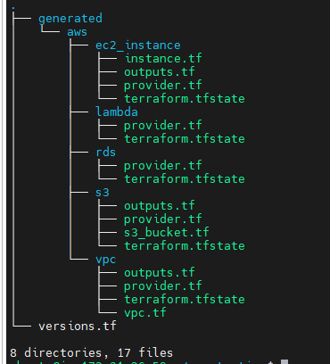

- Handling Multiple Resources: You can also import multiple resources at once. For instance, to import both RDS and Lambda resources from the us-west-1 region:
```bash
terraformer import aws --resources=rds,lambda --regions=us-west-1
```

This command will generate Terraform files for both RDS and Lambda resources, making it easy to manage them as code.

<span style="color: yellow;">More Example: 
+ terraformer import aws --resources=vpc,subnet --regions=us-east-1

To test Terraformer, you can use it to import resources from a cloud provider. For example, if you're using AWS, you'd run:
```bash
terraformer import aws --resources=vpc,subnet --regions=us-east-1
```
This command will generate Terraform configuration files for the specified AWS resources.
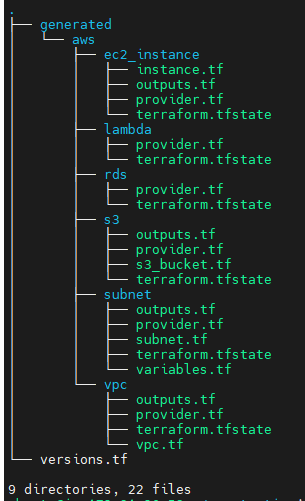

### 3. Terraformer import for <span style="color: yellow;">all Resources</span>
```bash
terraformer import aws --resources=* --regions=us-east-1
```
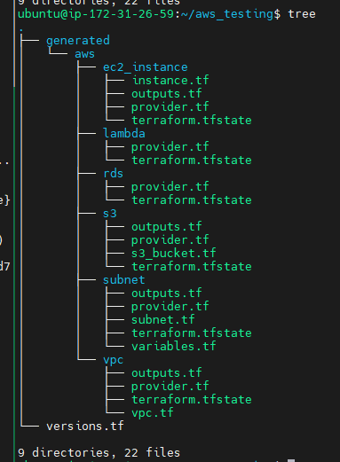

## ```Terraformer challenges```

Terraformer generates a separate folder for each resource. However, when dealing with a large number of resources, managing multiple state files can become challenging. Additionally, Terraformer often creates code with hardcoded values. To create an immutable environment, you would need to manually refactor the code to use variables, which can be time-consuming and require significant effort. To address these challenges, [Cloudtechner](https://github.com/cloudtechner/ct-terraformer-automation) have developed utilities to merge state files and automate the conversion of hardcoded values into variables. These utilities are available in a public repository, which contains a shell script and a Python script. You can use and modify these scripts according to your specific requirements.

```Statefile Merging``` --> https://github.com/cloudtechner/ct-terraformer-automation/blob/main/tfstate-merge.sh
 
```Hard-coded values``` --> https://github.com/cloudtechner/ct-terraformer-automation/blob/main/terraformer-variables-automation.py  

Note--> this repo, there is a syntax error; you can use the file attached to my repo (terraformer-variables-automation.py & tfstate-merge.sh).


+ Now, let’s proceed with a ```short demonstration```. First, we'll address the challenge of hardcoded values. For instance, when navigating to the EC2 instance directory, you’ll notice hardcoded values like the AMI ID and instance type in the main.tf file. To automate this process, we’ve developed a Python script that acts as a comprehensive tool for importing resources and automating them with a single command.

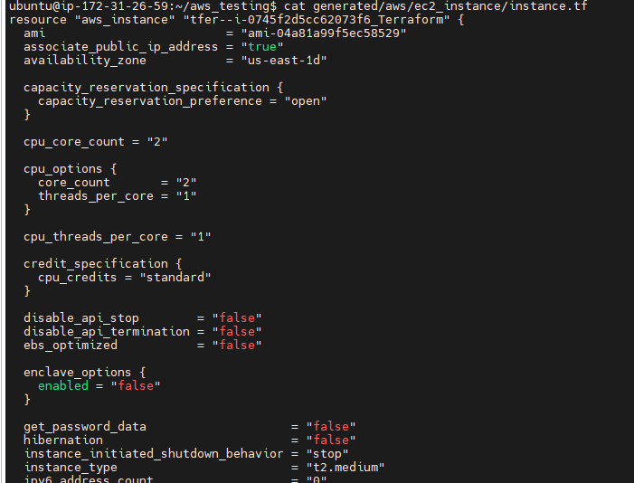

Now, we will ```python3 terraformer-variables-automation.py``` file
```bash
$ python3 terraformer-variables-automation.py
```
When running the script, it prompts you to enter the provider (in our case, AWS), the region (e.g., us-east-1), and the resource name (e.g., EC2 instance). Upon execution, it begins importing the EC2 instance from the specified region. After that, it asks which resource you want to automate. For example, if you choose the EC2 instance, it lists all the generated files and asks which one you want to convert into a TF file. Once you provide the file name, the script replaces attributes like AMI, instance type, subnet IDs, and availability zones within the instance.tf file.

```bash
Please enter the following inputs
Enter the provider: aws  # provider name
Enter the region: us-east-1 # Provide region
Enter the resource name: ec2_instance # provide resource name, it could be EC2, S3, VPC, Security
Enter the name of the resource you want to automate: vpc # provide resource name
Enter the name of the file you want to variablize (with .tf extension):vpc.tf # need to give complete ```tf``` file name.
```
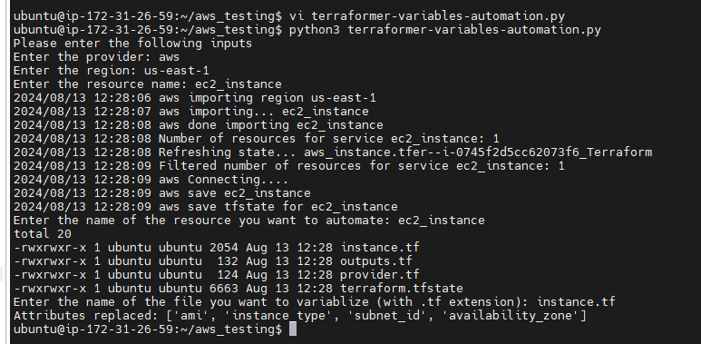


Additionally, the script creates a ```module``` directory that contains both the ```resource.tf``` and ```variable.tf``` files. The ```variable.tf``` file stores all the values, and the ```resource.tf``` file contains the module for the EC2 instance. When you open the ```main.tf``` file, you’ll see that all values have been replaced and sent to the ```variable.tf``` file under the module directory.

If you see the ec2_instance all values are hardcoded and will run the python command and will variablize it.

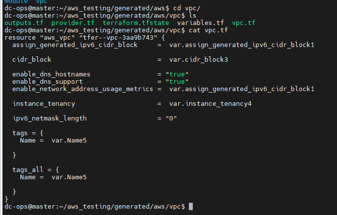

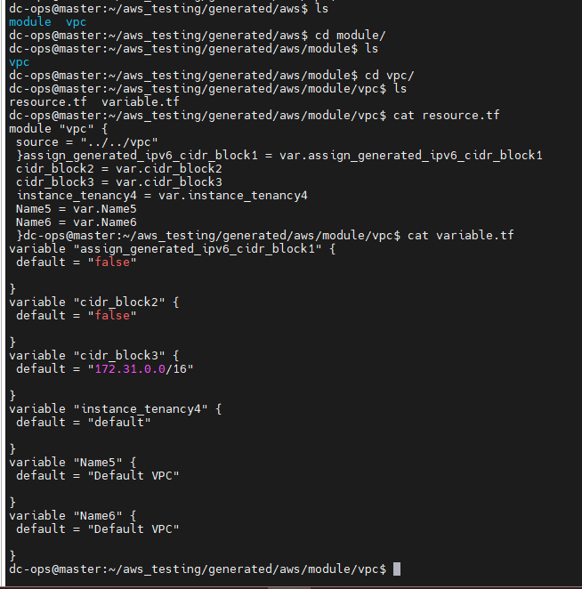


+ Moving on to our second challenge—```merging state``` files for multiple resources—we’ve developed a shell script for this purpose. The script allows you to specify the resources for merging and the target directory where the merged state file will be saved. 

__For example__, to merge the state files of VPC and S3, you simply run the script with those resource names. The script then merges the state files and creates a backup of the original file. This utility can be particularly useful for managing multiple state files across different resources.
```bash
$ ls -l
total 20
drwxrwxr-x 3 dc-ops dc-ops 4096 Aug 14 11:30 generated
-rw-rw-r-- 1 dc-ops dc-ops 4185 Aug 14 11:31 terraformer-variables-automation.py
-rw-rw-r-- 1 dc-ops dc-ops 1204 Aug 14 12:04 tfstate-merge.sh
-rw-rw-r-- 1 dc-ops dc-ops  121 Aug 14 11:28 version.tf

# change the permission
dc-ops@master:~/aws_testing$ chmod +x tfstate-merge.sh

dc-ops@master:~/aws_testing$ ls -l
total 20
drwxrwxr-x 3 dc-ops dc-ops 4096 Aug 14 11:30 generated
-rw-rw-r-- 1 dc-ops dc-ops 4185 Aug 14 11:31 terraformer-variables-automation.py
-rwxrwxr-x 1 dc-ops dc-ops 1204 Aug 14 12:04 tfstate-merge.sh
-rw-rw-r-- 1 dc-ops dc-ops  121 Aug 14 11:28 version.tf
dc-ops@master:~/aws_testing$
```
move ```tfstate-merge.sh``` file to under ```generated/aws```directory path as below.
```bash
dc-ops@master:~/aws_testing/generated/aws$ pwd
/home/dc-ops/aws_testing/generated/aws
```
Command 
```sh
dc-ops@master:~/aws_testing$ mv tfstate-merge.sh generated/aws/

dc-ops@master:~/aws_testing$ cd generated/aws/
dc-ops@master:~/aws_testing/generated/aws$ ls
module  s3  tfstate-merge.sh  vpc
dc-ops@master:~/aws_testing/generated/
```

Now, run the ```tfstate-merge.sh``` file.

## Syntax
```sh
 tfstate-merge.sh <to resources> <from resouces>
```
command
```sh
./tfstate-merge.sh vpc s3
```

```bash
 ./tfstate-merge.sh vpc s3
> START
>> TF = Terraform v1.9.4
on linux_amd64...
>> state pull
Initializing the backend...
╷
│ Error: Invalid legacy provider address
│
│ This configuration or its associated state refers to the unqualified provider "aws".
│
│ You must complete the Terraform 0.13 upgrade process before upgrading to later versions.
╵
/home/dc-ops/aws_testing/generated/aws
>> state mv
Initializing the backend...
╷
│ Error: Invalid legacy provider address
│
│ This configuration or its associated state refers to the unqualified provider "aws".
│
│ You must complete the Terraform 0.13 upgrade process before upgrading to later versions.
╵
Move "aws_s3_bucket.tfer--mrsinghbucket080320222" to "aws_s3_bucket.tfer--mrsinghbucket080320222"
Successfully moved 1 object(s).
/home/dc-ops/aws_testing/generated/aws
>> state push
/home/dc-ops/aws_testing/generated/aws
> FINISHED
```
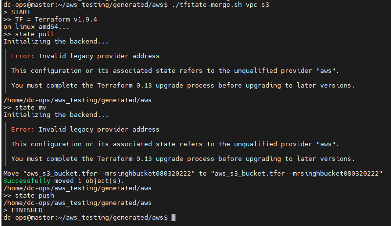


## <span style="color: red;">Conclusion</span>
Terraformer is a powerful tool that bridges the gap between manually created infrastructure and Infrastructure as Code. By automating the generation of Terraform files and state, it saves time, reduces errors, and ensures that your infrastructure is consistently managed through code. Whether you're modernizing legacy infrastructure or scaling new projects, Terraformer provides the efficiency and reliability needed to succeed in a DevOps environment.

By incorporating Terraformer into your workflow, you can streamline the transition from manual configurations to a code-driven infrastructure, setting the stage for a more efficient and automated future.