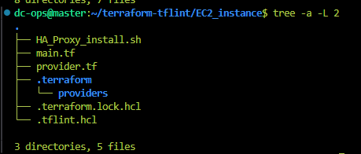
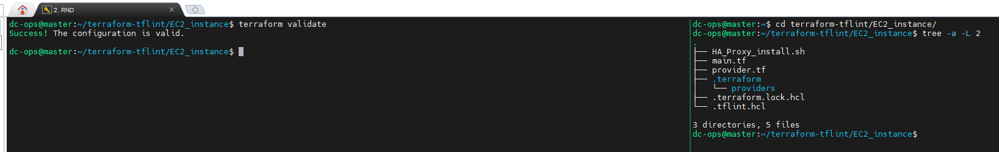
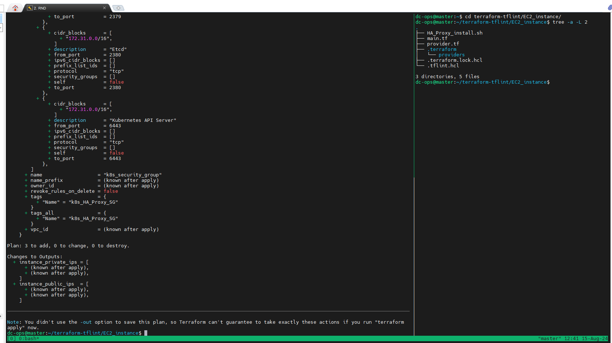
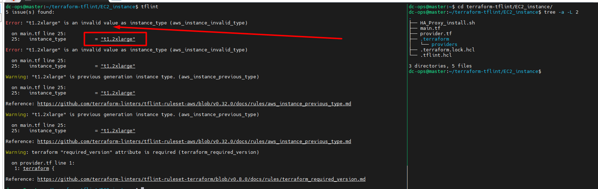
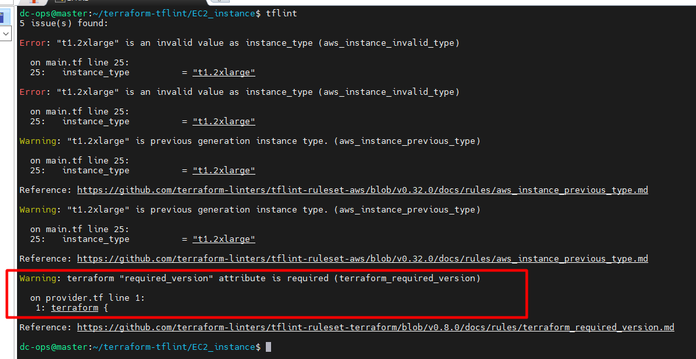
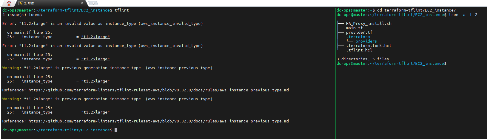

## <span style="color: yellow;"> A Comprehensive Guide to Terraform Linters: TFLint
In the world of Infrastructure as Code (IaC), Terraform is a widely used tool that allows you to define and manage your cloud infrastructure through code. However, like any code, your Terraform configurations need to be clean, error-free, and aligned with best practices. That’s where TFLint comes into play.

## <span style="color: yellow;"> What is TFLint?
TFLint is a powerful linter specifically designed for Terraform. A linter is a tool that analyzes your code to identify potential errors, bugs, stylistic issues, and deviations from best practices. TFLint helps you maintain high-quality Terraform configurations by catching mistakes early and providing recommendations for improvement.

## <span style="color: yellow;"> Why TFLint?
When working with Terraform, it's essential to maintain clean and efficient code. TFLint is a game-changer in this regard, offering insights that help avoid common pitfalls and enhance the quality of your infrastructure as code.

## <span style="color: yellow;"> Key Features of TFLint:
<span style="color: cyan;">__Error Detection__</span>: TFLint detects common errors in your Terraform code before you even run terraform plan or terraform apply.

<span style="color: cyan;">__Best Practices__</span>: It enforces best practices by checking your code against a set of predefined rules, ensuring your infrastructure is secure, efficient, and maintainable.

<span style="color: cyan;">__Extensible__</span>: TFLint is highly customizable. You can extend it with plugins and create custom rules to suit your specific needs.

<span style="color: cyan;">__Integration__</span>: It easily integrates with CI/CD pipelines, helping automate the process of checking your Terraform code for errors.

## <span style="color: yellow;"> TFLint vs. Terraform Plan: What’s the Difference?
It's important to differentiate between TFLint and the Terraform command terraform plan, as both serve distinct purposes:

### <span style="color: cyan;">__Terraform Plan__:
__Purpose__:  Shows the changes that will be made to your infrastructure. 

__Function__: Shows you what actions Terraform will take (e.g., creating, updating, or deleting resources).

__When to Use__: Before applying your Terraform code to see what changes will occur in your infrastructure.

__Focus__: Infrastructure changes and resource management. 

__Outcome__: Provides a detailed execution plan without making any changes to your infrastructure.

### <span style="color: cyan;">__TFLint__:
__Purpose__: Lints (checks) your Terraform code for errors, misconfigurations, and best practice violations.

__Function__: Analyzes the code itself without interacting with the actual infrastructure.

__When to Use__: During the development process to ensure your Terraform files are clean, consistent, and follow best practices.

__Focus__: Code quality and compliance with best practices. 

__Outcome__: Identifies issues in your code, helping you fix them before running terraform plan or terraform apply.

## <span style="color: yellow;"> Why Use Both?
Using TFLint alongside terraform plan provides a robust workflow. TFLint ensures your code is clean and adheres to best practices, while terraform plan allows you to review the specific changes Terraform will make to your infrastructure. This combination minimizes errors and increases the reliability of your Terraform deployments.

## <span style="color: yellow;"> How to Install and Use TFLint:
<span style="color: cyan;">__Installation__:

Install Go: TFLint is built with Go, so make sure you have Go installed.

You can [download Go from here](https://go.dev/doc/install).

<span style="color: cyan;">__Install TFLint__:

Run the following command:
```bash
sudo apt  install gccgo-go
go install github.com/terraform-linters/tflint@latest
                       or

curl -s https://raw.githubusercontent.com/terraform-linters/tflint/master/install_linux.sh | bash
```

<span style="color: cyan;">__Verify Installation__:

Check the installed version by running:
```bash
tflint --version

outcomes-
TFLint version 0.52.0
+ ruleset.terraform (0.8.0-bundled)
```

## <span style="color: yellow;">Using TFLint:
Once installed, using TFLint is straightforward:

Navigate to your Terraform project directory.
Run:
```bash
tflint
```
## <span style="color: yellow;">Install Plugins (if needed): 
For AWS, Azure, or GCP, you can install specific plugins to enhance TFLint’s capabilities. 

TFLint will analyze your Terraform files and provide a report of any issues or recommendations.

Now, we will confiure the plugins.
First, we will create a directory called ```terraform-tflint/EC2_instance```. You can use any directory. For my demo, I am using ```Terraform-tflint```.

Inside the directory, we will create a file called ```.tflint.hcl```. Make sure the file name is the same, and inside this file, we will use the following value:

```bash
plugin "aws" {
    enabled = true
    version = "0.32.0"
    source  = "github.com/terraform-linters/tflint-ruleset-aws"
}

plugin "terraform" {
  enabled = true
  preset  = "recommended"
}
```
Now, we will use ```tflint --init``` to initialize the plugin.

## <span style="color: yellow;">To Test:

Folder Terraform Structure



In your ```main.tf``` file, where you have mentioned the instance type for EC2, change the value to blow. For example, we will give the wrong ```instance_type = t1.2xlarge``` 
```sh
resource "aws_instance" "web" {
  ami           = "ami-0ff8a91507f77f867"
  instance_type = "t1.2xlarge" # invalid type!
}
```
since ```t1.2xlarge``` is an invalid instance type, an error will occur when you run ```Terraform Apply```. But ```Terraform validate``` and ```Terraform Plan``` cannot find this possible error in advance. That's because it's an AWS provider-specific issue, and it's valid as the Terraform Language.


Demo:
```bash
terraform validate
terraform plan
```





Now, we will initiate ```tflint``` and see the result.
```bash
~/terraform-tflint/EC2_instance$ tflint 
```



<span style="color: cyan;">__Note__</span> &rArr; If you want to avoid the warning in tflint outcome then you have to modify the ```.tflint.hcl``` as below.

```bash
rule "terraform_required_version" {
  enabled = false
}
```




Final view of after adding 
```bash
plugin "aws" {
    enabled = true
    version = "0.32.0"
    source  = "github.com/terraform-linters/tflint-ruleset-aws"
}

plugin "terraform" {
  enabled = true
  preset  = "recommended"
}

rule "terraform_required_version" {
  enabled = false
}
```

Now, run the below command again.
```sh
tflint --init 
```

When you run the tflint again, the warning shouldn't appear.



## <span style="color: yellow;"> Conclusion
```TFLint``` is an essential tool for anyone working with Terraform. It helps maintain high standards of code quality, reduces the likelihood of errors, and promotes best practices in infrastructure management. By integrating TFLint into your workflow, you can catch issues early, save time, and ensure that your Terraform code is both efficient and secure.

This blog post is designed to provide a comprehensive yet accessible overview of TFLint, along with a clear comparison to terraform plan. It highlights key points in a way that is easy for readers to grasp, making it suitable for both beginners and more experienced practitioners in the DevOps space.

:rocket:Ref Link [Installation](https://go.dev/doc/install), [About tflint](https://github.com/terraform-linters/tflint), [tflint-ruleset-aws](https://github.com/terraform-linters/tflint-ruleset-aws)

