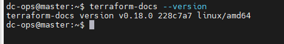
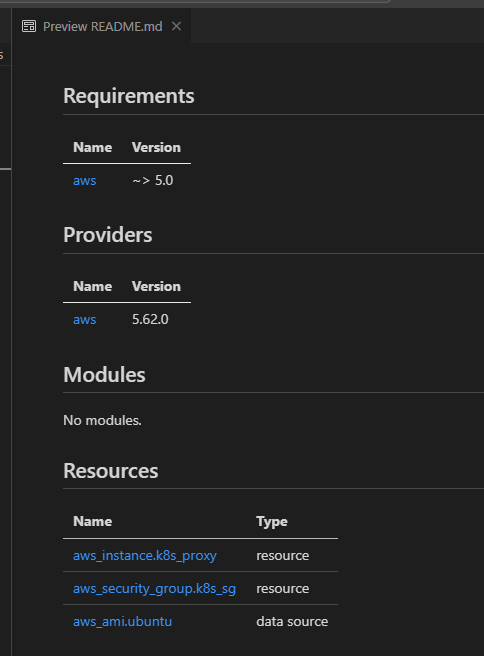

# <span style="color: yellow;">  Mastering Terraform-Docs: The Ultimate Guide to Auto-Documenting Your IaC

## <span style="color: yellow;"> Introduction
Terraform is a widely-used tool for automating infrastructure as code (IaC). As your Terraform projects grow, maintaining clear and consistent documentation becomes crucial. This is where terraform-docs comes in handy. Terraform-docs is a command-line tool that automatically generates documentation for your Terraform modules, making it easier for your team to understand and use your infrastructure code.

## <span style="color: yellow;"> Why Use Terraform-Docs?
Documenting Terraform modules manually can be time-consuming and error-prone. Terraform-docs simplifies this process by automating documentation generation.

Here’s why you should consider using it:

<span style="color: cyan;">__Consistency__</span>: Ensures that all your Terraform modules are documented in a consistent format.

<span style="color: cyan;">__Efficiency__</span>: Saves time by automating the documentation process.

<span style="color: cyan;">__Clarity__</span>: Provides clear and structured documentation, making it easier for others to understand your modules.

<span style="color: cyan;">__Customizability__</span>: Allows customization of the generated documentation to fit your needs.

## <span style="color: yellow;"> Key Features of Terraform-Docs

<span style="color: cyan;">__Automated Generation__</span>: Generates documentation directly from your Terraform module code.

<span style="color: cyan;">__Supports Multiple Formats__</span>: Outputs documentation in formats like Markdown, JSON, and others.

<span style="color: cyan;">__Customization__</span>: Allows you to configure what information gets included in the documentation.

<span style="color: cyan;">__Integration with CI/CD__</span>: Can be integrated into CI/CD pipelines to keep your documentation up-to-date.

## <span style="color: yellow;"> Step-by-Step Installation Guide
Here’s how to install terraform-docs on ```Ubuntu``` operating systems:

Create an install.sh file, add the following content, and make it executable.

```bash
sudo tee install.sh > /dev/null <<EOF
curl -Lo ./terraform-docs.tar.gz https://github.com/terraform-docs/terraform-docs/releases/download/v0.18.0/terraform-docs-v0.18.0-$(uname)-amd64.tar.gz
tar -xzf terraform-docs.tar.gz
chmod +x terraform-docs
mv terraform-docs /usr/local/bin/terraform-docs
EOF
sudo chmod +x install.sh
```

## <span style="color: yellow;"> Manual installation (*optional*) if above doesn't work.

1. Download the latest release from the [GitHub Releases page](https://github.com/terraform-docs/terraform-docs/releases).

2. Extract the binary:
```bash
tar -xzf terraform-docs-*-linux-amd64.tar.gz
```
3. Move the binary to a directory in your $PATH:
```bash
sudo mv terraform-docs /usr/local/bin/
```

4. Verify the installation by running:
```bash
terraform-docs --version
```


5. Supported commands.
```bash
 terraform-docs
A utility to generate documentation from Terraform modules in various output formats

Usage:
  terraform-docs [PATH] [flags]
  terraform-docs [command]

Available Commands:
  asciidoc    Generate AsciiDoc of inputs and outputs
  completion  Generate shell completion code for the specified shell (bash, zsh, fish)
  help        Help about any command
  json        Generate JSON of inputs and outputs
  markdown    Generate Markdown of inputs and outputs
  pretty      Generate colorized pretty of inputs and outputs
  tfvars      Generate terraform.tfvars of inputs
  toml        Generate TOML of inputs and outputs
  version     Print the version number of terraform-docs
  xml         Generate XML of inputs and outputs
  yaml        Generate YAML of inputs and outputs

Flags:
  -c, --config string               config file name (default ".terraform-docs.yml")
      --footer-from string          relative path of a file to read footer from (default "")
      --header-from string          relative path of a file to read header from (default "main.tf")
  -h, --help                        help for terraform-docs
      --hide strings                hide section [all, data-sources, footer, header, inputs, modules, outputs, providers, requirements, resources]
      --lockfile                    read .terraform.lock.hcl if exist (default true)
      --output-check                check if content of output file is up to date (default false)
      --output-file string          file path to insert output into (default "")
      --output-mode string          output to file method [inject, replace] (default "inject")
      --output-template string      output template (default "<!-- BEGIN_TF_DOCS -->\n{{ .Content }}\n<!-- END_TF_DOCS -->")
      --output-values               inject output values into outputs (default false)
      --output-values-from string   inject output values from file into outputs (default "")
      --read-comments               use comments as description when description is empty (default true)
      --recursive                   update submodules recursively (default false)
      --recursive-include-main      include the main module (default true)
      --recursive-path string       submodules path to recursively update (default "modules")
      --show strings                show section [all, data-sources, footer, header, inputs, modules, outputs, providers, requirements, resources]
      --sort                        sort items (default true)
      --sort-by string              sort items by criteria [name, required, type] (default "name")
  -v, --version                     version for terraform-docs

Use "terraform-docs [command] --help" for more information about a command.

```

## <span style="color: yellow;"> How to Use Terraform-Docs
Once installed, using terraform-docs is straightforward. Navigate to your Terraform module directory and run:
```bash
terraform-docs markdown ./

or 

terraform-docs markdown . >README.md

or 

terraform-docs markdown . --output-file="./README.md"
```
This command generates documentation in Markdown format. You can customize the output by specifying different formats or using a configuration file.

Examples of Commands:

- Markdown Output:
```bash
terraform-docs markdown ./
```
- JSON Output:
```bash
terraform-docs json ./
```
- HTML Output:
```bash
terraform-docs html ./
```

If you are using ```Visual Studio code```, then install the following extension to view it in better mode.




## <span style="color: yellow;"> How to add Header and Footer in ```.md``` file.

- First we will create a file called ```.terraform-docs.yml``` and will the following content.
```bash
formatter: ''  # it's a keyword
header-from: 'header.txt'
footer-from: 'footer.txt'
```

On the same directory, we will create a two more files called ```header.txt``` & ```footer.txt``` and will paste the content as below-
```bash
vi header.txt

# Project
## This project focuses on enhancing the documentation process for Terraform modules using terraform-docs. By automating the generation of clear, consistent, and up-to-date documentation, this initiative aims to streamline workflows, improve collaboration, and ensure that infrastructure code is easily understandable by all team members.
```

```bash
vi footer.txt
# Known Issues in Terraform
- State File Locking Conflicts
- Provider Version Compatibility
- Resource Deletion Issues
- Module Dependency Management

# You can paste any text as per your choice, but if you are preparing a project, the text should be related to that project, and if there is any known issue, highlight it.
```

Now, run the markup command again and see the update md file.
```bash
terraform-docs markdown . --output-file="./README.md"
```


## <span style="color: yellow;"> Best Practices
<span style="color: cyan;">__Integrate with CI/CD__</span>: Add terraform-docs to your CI/CD pipeline to automatically generate and update documentation.

<span style="color: cyan;">__Use a Configuration File__</span>: Create a .terraform-docs.yml file in your module directory to customize the documentation output.

<span style="color: cyan;">__Keep Documentation Updated__</span>: Regularly regenerate documentation to reflect any changes in your Terraform modules.

## <span style="color: yellow;"> Conclusion
Terraform-docs is an essential tool for anyone working with Terraform. By automating the documentation process, it ensures consistency, saves time, and helps your team better understand your infrastructure code. Integrate terraform-docs into your workflow today and keep your documentation up-to-date effortlessly.

Key Points to Highlight
terraform-docs automates the generation of documentation for Terraform modules.
Supports multiple formats such as Markdown, JSON, and HTML.
Simple installation process for macOS, Linux, and Windows.
Easily customizable and can be integrated into CI/CD pipelines.
Encourages consistent and clear documentation practices.

:rocket: Ref Link: [Documentation](https://github.com/terraform-docs/terraform-docs/), [Introduction](https://terraform-docs.io/user-guide/introduction/), [Release version](https://github.com/terraform-docs/terraform-docs/releases),
[Configuration](https://terraform-docs.io/how-to/cli-flag-false-value/)

